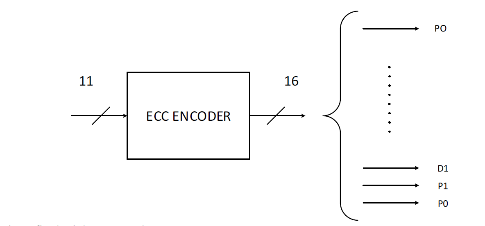

# Error Correcting Code ECC
 Implementation of SECDED (Single Error Correction, Double Error Detection), implemented for Electronic and Communication Systems
 
Progettare un circuito in grado di codificare una parola di 11 bit utilizzando la codifica di Hamming. La
parola di uscita deve essere codificata in modo che un decodificatore sia in grado di rilevare e correggere un
singolo bit errato sulla parola ricevuta e possa rilevare (ma non correggere) un doppio errore.
La codifica di Hamming implica l’aggiunta di alcuni bit di parità Px accanto a quelli della parola di ingresso
Dx. Ogni bit di parità deve essere calcolato attraverso l’operazione di XOR tra alcuni bit della parola di
ingresso. La tabella seguente indica, per ogni bit di parità, quali sono i bit coinvolti.

La seconda riga della tabella riporta come deve essere costruita la parola in uscita dal codificatore (posizione
1 indica il bit meno significativo)
Notare che il bit di partià PO, deve essere calcolato sfruttando anche gli altri bit di partià P1, P2, P4, P8.

La relazione finale del progetto deve contenere:
• Introduzione (descrizione algoritmo, possibili applicazioni, possibili architetture, etc.)
• Descrizione dell’architettura (diagramma a blocchi, ingressi/uscite, etc.)
• Codice VHDL (con commenti dettagliati)
• Test-plan e relativi Testbench per la verifica
• Risultati della sintesi logica automatica su piattaforma Xilinx FPGA Zync: risorse utilizzate (slice,
LUT, etc.), massima frequenza di funzionamento, cammino critico, etc. commentando eventuali
messaggi di warnings.
• Conclusioni